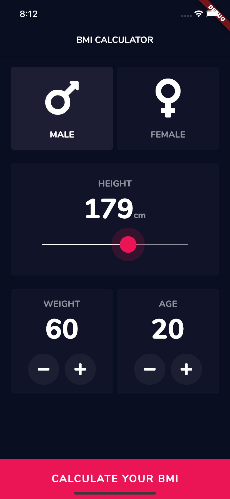
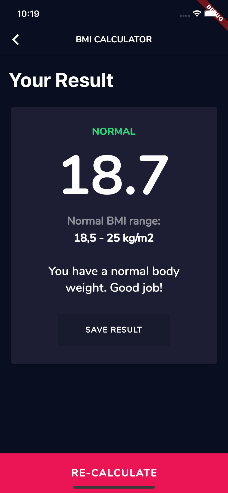

# BMI Calculator

A Body Mass Index Calculator inspired by the beautiful designs made by [Ruben Vaalt](https://dribbble.com/shots/4585382-Simple-BMI-Calculator).

### Library Used

- Material
- Dart Math
- FontAwesome

### Widgets / Classes Used

- SingleChildScrollView
- StatefulWidget
- Scaffold
- AppBar
- Text
- TextStyle
- SafeArea
- Padding
- Column
- Row
- Center
- Expanded
- FlatButton

## What I've learned so far thanks to this project:

- How to use Flutter themes to create coherent branding.
- How to create multi-page apps using Flutter Routes and Navigator.
- How to use the GestureDetector Widget to detect more than just a tap.
- How to customise Flutter Widgets to achieve a specific design style.

## Issues

Feel free to submit issues and enhancement requests.

## Contributing

Please refer to each project's style guidelines and guidelines for submitting patches and additions. In general, we follow the "fork-and-pull" Git workflow.

 1. **Fork** the repo on GitHub
 2. **Clone** the project to your own machine
 3. **Commit** changes to your own branch
 4. **Push** your work back up to your fork
 5. Submit a **Pull request** so that we can review your changes

## License

    Copyright 2020 Piotr Ekert

    Licensed under the Apache License, Version 2.0 (the "License");
    you may not use this file except in compliance with the License.
    You may obtain a copy of the License at

       http://www.apache.org/licenses/LICENSE-2.0

    Unless required by applicable law or agreed to in writing, software
    distributed under the License is distributed on an "AS IS" BASIS,
    WITHOUT WARRANTIES OR CONDITIONS OF ANY KIND, either express or implied.
    See the License for the specific language governing permissions and
    limitations under the License.
